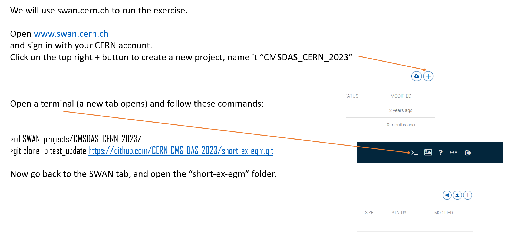

\0;10;1cEGamma exercise
---------------
This exercise provdes an introduction to CMS electron and photon objects. It is used as part of:

Some references:
 - [CMSDAS CERN 2023](https://indico.cern.ch/event/1257234/)
 - [CMSDAS LPC 2023](https://twiki.cern.ch/twiki/bin/view/CMS/SWGuideCMSDataAnalysisSchoolLPC2023EGammaShortExercise)
 - [CMSDAS 2021](https://twiki.cern.ch/twiki/bin/view/CMS/SWGuideCMSDataAnalysisSchoolLPC2021EGammaExercise)
 - [LPC HATS 2020](https://twiki.cern.ch/twiki/bin/view/CMS/EGammaHATSatLPC2020)
 - [CMSDAS 2020](https://twiki.cern.ch/twiki/bin/view/CMS/SWGuideCMSDataAnalysisSchoolLPC2020EGammaExercise)

We will use here https://swan.cern.ch
Please use "102", maximum cores and maximum RAM, when selecting the environment.

Copy commands below:
>`cd SWAN_projects/CMSDAS_CERN_2023/`
>`git clone -b test_update https://github.com/CERN-CMS-DAS-2023/short-ex-egm.git`

We will start with `exercise-1.ipynb` and then move to `exercise-2.ipynb`